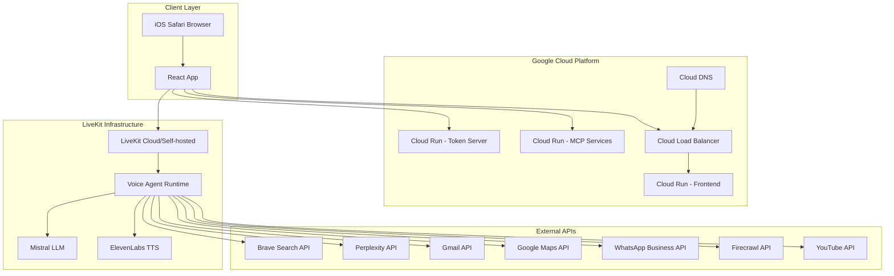

# Fall Detection Voice Agent - Google Cloud Run Deployment & LiveKit Integration Guide

This comprehensive guide covers deploying the Fall Detection Voice Agent system to Google Cloud Run and orchestrating it with LiveKit agents for production use.

## Architecture Overview



## Prerequisites

Before starting, ensure you have:

- Google Cloud Project with billing enabled
- Google Cloud SDK installed and authenticated
- Docker installed locally
- Domain name (optional, for custom SSL)
- API keys for all required services
- LiveKit server access (Cloud or self-hosted)

## Part 1: Infrastructure Setup

### 1.1 Enable Required Google Cloud Services

```bash
# Enable necessary APIs
gcloud services enable run.googleapis.com
gcloud services enable cloudbuild.googleapis.com
gcloud services enable containerregistry.googleapis.com
gcloud services enable storage.googleapis.com
gcloud services enable cloudresourcemanager.googleapis.com
gcloud services enable secretmanager.googleapis.com
gcloud services enable compute.googleapis.com
gcloud services enable dns.googleapis.com

# Set default region (choose one close to your users)
gcloud config set run/region us-central1
```

### 1.2 Create Secret Manager Secrets

Store all sensitive API keys in Google Secret Manager:

```bash
# Create secrets for all API keys
gcloud secrets create mistral-api-key --data-file=<(echo -n "YOUR_MISTRAL_KEY")
gcloud secrets create elevenlabs-api-key --data-file=<(echo -n "YOUR_ELEVENLABS_KEY")
gcloud secrets create livekit-api-key --data-file=<(echo -n "YOUR_LIVEKIT_KEY")
gcloud secrets create livekit-api-secret --data-file=<(echo -n "YOUR_LIVEKIT_SECRET")
gcloud secrets create brave-api-key --data-file=<(echo -n "YOUR_BRAVE_KEY")
gcloud secrets create perplexity-api-key --data-file=<(echo -n "YOUR_PERPLEXITY_KEY")
gcloud secrets create google-maps-api-key --data-file=<(echo -n "YOUR_GOOGLE_MAPS_KEY")
gcloud secrets create firecrawl-api-key --data-file=<(echo -n "YOUR_FIRECRAWL_KEY")
gcloud secrets create gmail-app-password --data-file=<(echo -n "YOUR_GMAIL_APP_PASSWORD")
```

## Part 2: Containerization

### 2.1 Frontend Application Dockerfile

Create `Dockerfile.frontend`:

```dockerfile
# Multi-stage build for React frontend
FROM node:18-alpine as builder

WORKDIR /app

# Copy package files
COPY package*.json ./
RUN npm ci --only=production

# Copy source code
COPY . .

# Build for production
RUN npm run build

# Production stage with Nginx
FROM nginx:alpine

# Copy built assets
COPY --from=builder /app/dist /usr/share/nginx/html

# Copy custom nginx configuration
COPY nginx.conf /etc/nginx/conf.d/default.conf

# Health check endpoint
RUN echo '<html><body>OK</body></html>' > /usr/share/nginx/html/health

# Expose port
EXPOSE 8080

# Start nginx
CMD ["nginx", "-g", "daemon off;"]
```

### 2.2 Nginx Configuration

Create `nginx.conf`:

```nginx
server {
    listen 8080;
    server_name _;
    root /usr/share/nginx/html;
    index index.html;

    # Enable gzip compression
    gzip on;
    gzip_types text/css application/javascript application/json image/svg+xml;
    gzip_comp_level 9;

    # Security headers
    add_header X-Frame-Options "SAMEORIGIN" always;
    add_header X-Content-Type-Options "nosniff" always;
    add_header X-XSS-Protection "1; mode=block" always;
    add_header Referrer-Policy "strict-origin-when-cross-origin" always;
    
    # Permissions Policy for device access (required for fall detection)
    add_header Permissions-Policy "accelerometer=(self), gyroscope=(self), magnetometer=(self), microphone=(self), geolocation=(self)" always;

    # Health check endpoint
    location /health {
        access_log off;
        return 200 "OK\n";
        add_header Content-Type text/plain;
    }

    # SPA routing - serve index.html for all routes
    location / {
        try_files $uri $uri/ /index.html;
        
        # Cache static assets
        location ~* \.(js|css|png|jpg|jpeg|gif|ico|svg|woff|woff2|ttf|eot)$ {
            expires 1y;
            add_header Cache-Control "public, immutable";
        }
    }

    # API proxy (if needed for local MCP servers)
    location /api/ {
        proxy_pass http://mcp-gateway:8080/;
        proxy_set_header Host $host;
        proxy_set_header X-Real-IP $remote_addr;
        proxy_set_header X-Forwarded-For $proxy_add_x_forwarded_for;
        proxy_set_header X-Forwarded-Proto $scheme;
    }
}
```

### 2.3 Token Server Dockerfile

Create `Dockerfile.tokenserver`:

```dockerfile
FROM node:18-alpine

WORKDIR /app

# Copy package files
COPY server/package*.json ./
RUN npm ci --only=production

# Copy server code
COPY server/ .

# Create non-root user
RUN addgroup -g 1001 -S nodejs && \
    adduser -S nodejs -u 1001

# Change ownership
RUN chown -R nodejs:nodejs /app
USER nodejs

# Expose port
EXPOSE 8080

# Health check
HEALTHCHECK --interval=30s --timeout=3s --start-period=5s --retries=3 \
  CMD node -e "require('http').get('http://localhost:8080/health', (res) => { \
    process.exit(res.statusCode === 200 ? 0 : 1); \
  }).on('error', () => process.exit(1));"

# Start server
CMD ["node", "livekitTokenServer.js"]
```

### 2.4 MCP Services Orchestrator Dockerfile

Create `Dockerfile.mcp-gateway`:

```dockerfile
FROM node:18-alpine

WORKDIR /app

# Install dependencies for gateway service
RUN npm init -y && \
    npm install express cors http-proxy-middleware dotenv

# Create gateway server
COPY <<EOF gateway-server.js
const express = require('express');
const cors = require('cors');
const { createProxyMiddleware } = require('http-proxy-middleware');
require('dotenv').config();

const app = express();
const PORT = process.env.PORT || 8080;

app.use(cors());
app.use(express.json());

// Health check
app.get('/health', (req, res) => {
  res.json({ status: 'ok', timestamp: new Date().toISOString() });
});

// Proxy routes to individual MCP services
const mcpServices = {
  'brave-search': process.env.BRAVE_SEARCH_URL || 'http://mcp-brave:8080',
  'perplexity': process.env.PERPLEXITY_URL || 'http://mcp-perplexity:8080',
  'gmail': process.env.GMAIL_URL || 'http://mcp-gmail:8080',
  'google-maps': process.env.GOOGLE_MAPS_URL || 'http://mcp-googlemaps:8080',
  'firecrawl': process.env.FIRECRAWL_URL || 'http://mcp-firecrawl:8080',
  'youtube': process.env.YOUTUBE_URL || 'http://mcp-youtube:8080',
  'whatsapp': process.env.WHATSAPP_URL || 'http://mcp-whatsapp:8080'
};

Object.entries(mcpServices).forEach(([service, targetUrl]) => {
  app.use(\`/\${service}\`, createProxyMiddleware({
    target: targetUrl,
    changeOrigin: true,
    timeout: 30000,
    pathRewrite: {
      [\`^/\${service}\`]: ''
    },
    onError: (err, req, res) => {
      console.error(\`Proxy error for \${service}:\`, err.message);
      res.status(502).json({ error: 'Service unavailable', service });
    }
  }));
});

app.listen(PORT, () => {
  console.log(\`MCP Gateway running on port \${PORT}\`);
  console.log('Available services:', Object.keys(mcpServices));
});
EOF

EXPOSE 8080

CMD ["node", "gateway-server.js"]
```

## Part 3: Cloud Run Deployment

### 3.1 Build and Push Images

```bash
# Set project ID
export PROJECT_ID=$(gcloud config get-value project)

# Build frontend
gcloud builds submit --tag gcr.io/$PROJECT_ID/fall-detection-frontend .

# Build token server
gcloud builds submit --tag gcr.io/$PROJECT_ID/livekit-token-server -f Dockerfile.tokenserver .

# Build MCP gateway (if using centralized approach)
gcloud builds submit --tag gcr.io/$PROJECT_ID/mcp-gateway -f Dockerfile.mcp-gateway .
```

### 3.2 Deploy Frontend to Cloud Run

```bash
gcloud run deploy fall-detection-frontend \
  --image gcr.io/$PROJECT_ID/fall-detection-frontend \
  --platform managed \
  --region us-central1 \
  --allow-unauthenticated \
  --port 8080 \
  --memory 512Mi \
  --cpu 1 \
  --min-instances 0 \
  --max-instances 10 \
  --set-env-vars VITE_ENVIRONMENT=production \
  --set-env-vars VITE_LIVEKIT_URL=wss://your-livekit-server.com \
  --set-env-vars VITE_TOKEN_SERVER_URL=https://livekit-token-server-xxxxx.run.app
```

### 3.3 Deploy Token Server to Cloud Run

```bash
gcloud run deploy livekit-token-server \
  --image gcr.io/$PROJECT_ID/livekit-token-server \
  --platform managed \
  --region us-central1 \
  --allow-unauthenticated \
  --port 8080 \
  --memory 256Mi \
  --cpu 1 \
  --min-instances 1 \
  --max-instances 5 \
  --set-env-vars TOKEN_SERVER_PORT=8080 \
  --update-secrets LIVEKIT_API_KEY=livekit-api-key:latest \
  --update-secrets LIVEKIT_API_SECRET=livekit-api-secret:latest
```

### 3.4 Deploy Individual MCP Services

Deploy each MCP service as a separate Cloud Run service:

```bash
# Brave Search MCP
gcloud run deploy mcp-brave-search \
  --image mcp/brave-search \
  --platform managed \
  --region us-central1 \
  --no-allow-unauthenticated \
  --port 8080 \
  --memory 256Mi \
  --cpu 1 \
  --min-instances 0 \
  --max-instances 3 \
  --update-secrets BRAVE_API_KEY=brave-api-key:latest

# Perplexity MCP
gcloud run deploy mcp-perplexity \
  --image mcp/perplexity-ask \
  --platform managed \
  --region us-central1 \
  --no-allow-unauthenticated \
  --port 8080 \
  --memory 256Mi \
  --cpu 1 \
  --update-secrets PERPLEXITY_API_KEY=perplexity-api-key:latest

# Gmail MCP
gcloud run deploy mcp-gmail \
  --image yashtekwani/gmail-mcp \
  --platform managed \
  --region us-central1 \
  --no-allow-unauthenticated \
  --port 8080 \
  --memory 256Mi \
  --cpu 1 \
  --set-env-vars EMAIL_ADDRESS=${GMAIL_ADDRESS} \
  --set-env-vars IMAP_HOST=imap.gmail.com \
  --set-env-vars IMAP_PORT=993 \
  --set-env-vars SMTP_HOST=smtp.gmail.com \
  --set-env-vars SMTP_PORT=587 \
  --update-secrets EMAIL_PASSWORD=gmail-app-password:latest

# Google Maps MCP
gcloud run deploy mcp-google-maps \
  --image mcp/google-maps-comprehensive \
  --platform managed \
  --region us-central1 \
  --no-allow-unauthenticated \
  --port 8080 \
  --memory 256Mi \
  --cpu 1 \
  --update-secrets GOOGLE_MAPS_API_KEY=google-maps-api-key:latest

# Firecrawl MCP
gcloud run deploy mcp-firecrawl \
  --image mcp/firecrawl \
  --platform managed \
  --region us-central1 \
  --no-allow-unauthenticated \
  --port 8080 \
  --memory 512Mi \
  --cpu 1 \
  --set-env-vars FIRECRAWL_API_URL=https://api.firecrawl.dev/v1 \
  --update-secrets FIRECRAWL_API_KEY=firecrawl-api-key:latest

# YouTube MCP
gcloud run deploy mcp-youtube \
  --image mcp/youtube-transcript \
  --platform managed \
  --region us-central1 \
  --no-allow-unauthenticated \
  --port 8080 \
  --memory 256Mi \
  --cpu 1

# WhatsApp MCP
gcloud run deploy mcp-whatsapp \
  --image gcr.io/$PROJECT_ID/mcp-whatsapp \
  --platform managed \
  --region us-central1 \
  --no-allow-unauthenticated \
  --port 8080 \
  --memory 256Mi \
  --cpu 1 \
  --set-env-vars WHATSAPP_PHONE_NUMBER=${WHATSAPP_PHONE_NUMBER}
```

## Part 4: LiveKit Agent Integration

### 4.1 LiveKit Voice Agent Setup

Create a Python-based voice agent that integrates with your MCP services:

Create `voice-agent/Dockerfile`:

```dockerfile
FROM python:3.11-slim

WORKDIR /app

# Install system dependencies
RUN apt-get update && apt-get install -y \
    ffmpeg \
    && rm -rf /var/lib/apt/lists/*

# Copy requirements
COPY requirements.txt .
RUN pip install --no-cache-dir -r requirements.txt

# Copy agent code
COPY . .

# Run the agent
CMD ["python", "voice_agent.py"]
```

Create `voice-agent/requirements.txt`:

```txt
livekit-agents==0.8.0
livekit-plugins-openai==0.7.0
livekit-plugins-elevenlabs==0.6.0
mistralai==0.0.12
httpx==0.25.2
asyncio==3.4.3
python-dotenv==1.0.0
```

Create `voice-agent/voice_agent.py`:

```python
import asyncio
import logging
import os
from typing import Dict, Any
import httpx
from livekit import agents, rtc
from livekit.agents import AutoSubscribe, JobContext, WorkerOptions, cli, tokenize, tts
from livekit.agents.llm import ChatContext, ChatImage, ChatMessage
from livekit.agents.voice_assistant import VoiceAssistant
from livekit.plugins import openai, elevenlabs
from mistralai.client import MistralClient
from mistralai.models.chat_completion import ChatMessage as MistralChatMessage

# Configure logging
logging.basicConfig(level=logging.INFO)
logger = logging.getLogger(__name__)

class MCPClientService:
    """Client for interacting with MCP services deployed on Cloud Run"""
    
    def __init__(self):
        self.base_urls = {
            'brave': os.getenv('MCP_BRAVE_URL'),
            'perplexity': os.getenv('MCP_PERPLEXITY_URL'),
            'gmail': os.getenv('MCP_GMAIL_URL'),
            'maps': os.getenv('MCP_MAPS_URL'),
            'firecrawl': os.getenv('MCP_FIRECRAWL_URL'),
            'youtube': os.getenv('MCP_YOUTUBE_URL'),
            'whatsapp': os.getenv('MCP_WHATSAPP_URL'),
        }
        
    async def call_mcp_service(self, service: str, endpoint: str, data: Dict[str, Any]) -> Dict[str, Any]:
        """Make a call to an MCP service"""
        if service not in self.base_urls or not self.base_urls[service]:
            raise ValueError(f"MCP service {service} not configured")
            
        url = f"{self.base_urls[service]}/{endpoint}"
        
        async with httpx.AsyncClient(timeout=30.0) as client:
            try:
                response = await client.post(url, json=data)
                response.raise_for_status()
                return response.json()
            except httpx.HTTPError as e:
                logger.error(f"MCP service call failed: {e}")
                raise

class MistralLLMService:
    """Custom Mistral LLM integration"""
    
    def __init__(self):
        self.client = MistralClient(api_key=os.getenv('MISTRAL_API_KEY'))
        self.model = os.getenv('MISTRAL_MODEL', 'mistral-large-latest')
        
    async def chat_completion(self, messages: list[ChatMessage]) -> str:
        """Generate chat completion using Mistral"""
        mistral_messages = []
        
        for msg in messages:
            if isinstance(msg.content, str):
                mistral_messages.append(MistralChatMessage(
                    role=msg.role,
                    content=msg.content
                ))
                
        try:
            response = self.client.chat(
                model=self.model,
                messages=mistral_messages,
                temperature=0.7,
                max_tokens=1000
            )
            
            return response.choices[0].message.content
        except Exception as e:
            logger.error(f"Mistral API error: {e}")
            raise

class FallDetectionVoiceAgent:
    """Main voice agent that handles fall detection and emergency scenarios"""
    
    def __init__(self):
        self.mcp_client = MCPClientService()
        self.mistral_client = MistralLLMService()
        self.conversation_context = []
        
    async def handle_emergency_scenario(self, context: str) -> str:
        """Handle emergency-related requests"""
        emergency_prompt = f"""
        You are an emergency response AI assistant. The user may be in distress or need immediate help.
        
        Context: {context}
        
        Available actions:
        1. Send WhatsApp message to emergency contacts
        2. Send email alerts
        3. Get current location
        4. Search for nearby emergency services
        5. Provide calming guidance
        
        Respond with empathy and provide clear, actionable help.
        """
        
        response = await self.mistral_client.chat_completion([
            ChatMessage(role="system", content=emergency_prompt),
            ChatMessage(role="user", content=context)
        ])
        
        # Check if we need to trigger emergency actions
        if "emergency" in context.lower() or "help" in context.lower():
            await self._trigger_emergency_actions(context)
            
        return response
    
    async def handle_general_query(self, query: str) -> str:
        """Handle general queries using MCP services"""
        # Determine which MCP service to use based on query content
        if "search" in query.lower() or "find" in query.lower():
            return await self._handle_search_query(query)
        elif "email" in query.lower() or "gmail" in query.lower():
            return await self._handle_email_query(query)
        elif "location" in query.lower() or "directions" in query.lower():
            return await self._handle_maps_query(query)
        elif "whatsapp" in query.lower() or "message" in query.lower():
            return await self._handle_whatsapp_query(query)
        elif "youtube" in query.lower() or "video" in query.lower():
            return await self._handle_youtube_query(query)
        else:
            # Use Perplexity for general knowledge queries
            return await self._handle_perplexity_query(query)
    
    async def _handle_search_query(self, query: str) -> str:
        """Handle web search queries"""
        try:
            result = await self.mcp_client.call_mcp_service(
                'brave', 
                'search',
                {'query': query, 'count': 5}
            )
            
            # Format search results for voice response
            if result.get('web', {}).get('results'):
                results = result['web']['results'][:3]  # Top 3 results
                response = f"I found {len(results)} search results for '{query}':\n\n"
                for i, item in enumerate(results, 1):
                    response += f"{i}. {item.get('title', 'No title')}\n{item.get('description', 'No description')}\n\n"
                return response
            else:
                return f"I couldn't find any search results for '{query}'. Please try a different search term."
                
        except Exception as e:
            logger.error(f"Search query failed: {e}")
            return "I'm having trouble with the search service right now. Please try again later."
    
    async def _handle_email_query(self, query: str) -> str:
        """Handle email-related queries"""
        try:
            # Simple email check
            result = await self.mcp_client.call_mcp_service(
                'gmail', 
                'list_messages',
                {'max_results': 5, 'query': 'is:unread'}
            )
            
            if result.get('messages'):
                count = len(result['messages'])
                return f"You have {count} unread emails. Would you like me to read the subjects or help you compose a reply?"
            else:
                return "You have no unread emails at the moment."
                
        except Exception as e:
            logger.error(f"Email query failed: {e}")
            return "I'm having trouble accessing your email right now. Please check your email permissions."
    
    async def _handle_whatsapp_query(self, query: str) -> str:
        """Handle WhatsApp messaging"""
        # This would require parsing the query to extract phone number and message
        return "WhatsApp messaging functionality is available. Please provide the phone number and message you'd like to send."
    
    async def _handle_maps_query(self, query: str) -> str:
        """Handle location and directions queries"""
        try:
            result = await self.mcp_client.call_mcp_service(
                'maps', 
                'geocode',
                {'address': query}
            )
            
            if result.get('results'):
                location = result['results'][0]
                return f"I found the location: {location.get('formatted_address', 'Unknown')}. Would you like directions to this place?"
            else:
                return f"I couldn't find the location '{query}'. Please try a more specific address."
                
        except Exception as e:
            logger.error(f"Maps query failed: {e}")
            return "I'm having trouble with the maps service right now. Please try again later."
    
    async def _handle_youtube_query(self, query: str) -> str:
        """Handle YouTube transcript requests"""
        try:
            # Extract YouTube URL from query
            # This is a simplified implementation
            result = await self.mcp_client.call_mcp_service(
                'youtube', 
                'get_transcript',
                {'url': query}
            )
            
            if result.get('transcript'):
                transcript = result['transcript'][:500]  # Limit for voice response
                return f"Here's a summary of the video transcript: {transcript}..."
            else:
                return "I couldn't get the transcript for that video. Please make sure it's a valid YouTube URL."
                
        except Exception as e:
            logger.error(f"YouTube query failed: {e}")
            return "I'm having trouble with the YouTube service right now. Please try again later."
    
    async def _handle_perplexity_query(self, query: str) -> str:
        """Handle general knowledge queries via Perplexity"""
        try:
            result = await self.mcp_client.call_mcp_service(
                'perplexity', 
                'ask',
                {'question': query}
            )
            
            return result.get('answer', 'I could not find an answer to your question.')
            
        except Exception as e:
            logger.error(f"Perplexity query failed: {e}")
            return "I'm having trouble accessing the knowledge service right now. Please try again later."
    
    async def _trigger_emergency_actions(self, context: str):
        """Trigger emergency response actions"""
        try:
            # Send emergency WhatsApp message
            emergency_phone = os.getenv('EMERGENCY_PHONE')
            if emergency_phone:
                await self.mcp_client.call_mcp_service(
                    'whatsapp',
                    'send_message',
                    {
                        'phone': emergency_phone,
                        'message': f"EMERGENCY ALERT: Fall detected or emergency assistance requested. Context: {context}. Please check immediately."
                    }
                )
            
            # Send emergency email
            emergency_email = os.getenv('EMERGENCY_EMAIL')
            if emergency_email:
                await self.mcp_client.call_mcp_service(
                    'gmail',
                    'send_email',
                    {
                        'to': emergency_email,
                        'subject': 'EMERGENCY ALERT - Fall Detection System',
                        'body': f"Emergency assistance has been requested.\n\nContext: {context}\n\nPlease respond immediately."
                    }
                )
                
        except Exception as e:
            logger.error(f"Emergency actions failed: {e}")

async def entrypoint(ctx: JobContext):
    """Main entrypoint for the voice agent"""
    
    logger.info("Starting Fall Detection Voice Agent")
    
    # Initialize the agent
    agent_instance = FallDetectionVoiceAgent()
    
    # Initialize TTS
    tts_service = elevenlabs.TTS(
        voice=elevenlabs.Voice(
            id=os.getenv('ELEVENLABS_VOICE_ID', '21m00Tcm4TlvDq8ikWAM'),
            name="Rachel",
            category="premade",
            settings=elevenlabs.VoiceSettings(
                stability=0.71,
                similarity_boost=0.5,
                style=0.0,
                use_speaker_boost=True,
            ),
        ),
    )
    
    async def chat_completion_handler(
        chat_ctx: ChatContext,
    ) -> str:
        """Handle chat completion requests"""
        latest_message = chat_ctx.messages[-1]
        user_query = latest_message.content
        
        logger.info(f"Processing user query: {user_query}")
        
        # Check if this is an emergency scenario
        if any(word in user_query.lower() for word in ['emergency', 'help', 'fall', 'hurt', 'pain', 'accident']):
            response = await agent_instance.handle_emergency_scenario(user_query)
        else:
            response = await agent_instance.handle_general_query(user_query)
        
        logger.info(f"Generated response: {response[:100]}...")
        return response
    
    # Create voice assistant
    assistant = VoiceAssistant(
        vad=rtc.VADOptions(),
        stt=openai.STT(),
        llm=openai.LLM(),
        tts=tts_service,
        chat_ctx=ChatContext().append(
            role="system",
            text=(
                "You are a helpful voice assistant for a fall detection and emergency response system. "
                "You can help with general questions, emergency situations, searching the web, "
                "managing emails, sending WhatsApp messages, getting directions, and more. "
                "Always be empathetic and ready to help with emergency situations. "
                "Keep responses concise and clear for voice interaction."
            ),
        ),
        fnc_ctx=agents.llm.FunctionContext(),
    )
    
    # Override the chat completion handler
    assistant._llm.chat = chat_completion_handler
    
    # Start the voice assistant
    assistant.start(ctx.room)
    
    await asyncio.sleep(1)
    
    # Join the audio track
    await assistant.say("Hello! I'm your fall detection voice assistant. I'm here to help with emergencies, answer questions, and assist with various tasks. How can I help you today?", allow_interruptions=True)

if __name__ == "__main__":
    cli.run_app(WorkerOptions(entrypoint_fnc=entrypoint))
```

### 4.2 Deploy Voice Agent to Cloud Run

Create `voice-agent/deploy.sh`:

```bash
#!/bin/bash

# Build and deploy the voice agent
gcloud builds submit --tag gcr.io/$PROJECT_ID/livekit-voice-agent .

gcloud run deploy livekit-voice-agent \
  --image gcr.io/$PROJECT_ID/livekit-voice-agent \
  --platform managed \
  --region us-central1 \
  --no-allow-unauthenticated \
  --memory 1Gi \
  --cpu 2 \
  --min-instances 1 \
  --max-instances 5 \
  --timeout 3600 \
  --update-secrets MISTRAL_API_KEY=mistral-api-key:latest \
  --update-secrets ELEVENLABS_API_KEY=elevenlabs-api-key:latest \
  --update-secrets LIVEKIT_API_KEY=livekit-api-key:latest \
  --update-secrets LIVEKIT_API_SECRET=livekit-api-secret:latest \
  --set-env-vars LIVEKIT_URL=$(gcloud secrets versions access latest --secret="livekit-url") \
  --set-env-vars MCP_BRAVE_URL=https://mcp-brave-search-xxxx.run.app \
  --set-env-vars MCP_PERPLEXITY_URL=https://mcp-perplexity-xxxx.run.app \
  --set-env-vars MCP_GMAIL_URL=https://mcp-gmail-xxxx.run.app \
  --set-env-vars MCP_MAPS_URL=https://mcp-google-maps-xxxx.run.app \
  --set-env-vars MCP_FIRECRAWL_URL=https://mcp-firecrawl-xxxx.run.app \
  --set-env-vars MCP_YOUTUBE_URL=https://mcp-youtube-xxxx.run.app \
  --set-env-vars MCP_WHATSAPP_URL=https://mcp-whatsapp-xxxx.run.app \
  --set-env-vars EMERGENCY_PHONE=${EMERGENCY_PHONE} \
  --set-env-vars EMERGENCY_EMAIL=${EMERGENCY_EMAIL}
```

## Part 5: Load Balancer and Custom Domain

### 5.1 Set up Cloud Load Balancer

```bash
# Create a global static IP
gcloud compute addresses create fall-detection-ip --global

# Get the IP address
gcloud compute addresses describe fall-detection-ip --global --format="get(address)"
```

Create `load-balancer-config.yaml`:

```yaml
apiVersion: networking.gke.io/v1
kind: ManagedCertificate
metadata:
  name: fall-detection-ssl-cert
spec:
  domains:
    - yourdomain.com
    - www.yourdomain.com
---
apiVersion: networking.k8s.io/v1
kind: Ingress
metadata:
  name: fall-detection-ingress
  annotations:
    kubernetes.io/ingress.global-static-ip-name: fall-detection-ip
    networking.gke.io/managed-certificates: fall-detection-ssl-cert
    kubernetes.io/ingress.class: "gce"
spec:
  rules:
  - host: yourdomain.com
    http:
      paths:
      - path: /
        pathType: Prefix
        backend:
          service:
            name: fall-detection-frontend
            port:
              number: 80
  - host: www.yourdomain.com
    http:
      paths:
      - path: /
        pathType: Prefix
        backend:
          service:
            name: fall-detection-frontend
            port:
              number: 80
```

### 5.2 Configure DNS

Point your domain to the static IP:

```bash
# Create DNS zone (if not exists)
gcloud dns managed-zones create fall-detection-zone \
  --description="Fall Detection DNS Zone" \
  --dns-name=yourdomain.com

# Add A record
gcloud dns record-sets transaction start --zone=fall-detection-zone

gcloud dns record-sets transaction add [STATIC_IP_ADDRESS] \
  --name=yourdomain.com. \
  --ttl=300 \
  --type=A \
  --zone=fall-detection-zone

gcloud dns record-sets transaction add [STATIC_IP_ADDRESS] \
  --name=www.yourdomain.com. \
  --ttl=300 \
  --type=A \
  --zone=fall-detection-zone

gcloud dns record-sets transaction execute --zone=fall-detection-zone
```

## Part 6: Monitoring and Observability

### 6.1 Set up Cloud Monitoring

Create monitoring dashboard for all services:

```bash
# Create alerting policy for service health
gcloud alpha monitoring policies create --policy-from-file=monitoring-policy.yaml
```

Create `monitoring-policy.yaml`:

```yaml
displayName: "Fall Detection System Health"
conditions:
- displayName: "Cloud Run Service Down"
  conditionThreshold:
    filter: 'resource.type="cloud_run_revision"'
    comparison: COMPARISON_EQUAL
    thresholdValue: 0
    duration: 300s
    aggregations:
    - alignmentPeriod: 60s
      perSeriesAligner: ALIGN_RATE
      crossSeriesReducer: REDUCE_SUM
      groupByFields:
      - "resource.label.service_name"
notificationChannels:
- projects/[PROJECT_ID]/notificationChannels/[CHANNEL_ID]
enabled: true
```

### 6.2 Set up Logging

Create log-based metrics:

```bash
# Create log sink for errors
gcloud logging sinks create fall-detection-errors \
  bigquery.googleapis.com/projects/[PROJECT_ID]/datasets/fall_detection_logs \
  --log-filter='severity>=ERROR AND resource.type="cloud_run_revision"'
```

## Part 7: Orchestration and Scaling

### 7.1 Auto-scaling Configuration

All Cloud Run services are configured with auto-scaling. Monitor and adjust based on usage:

```bash
# Update scaling parameters for high-traffic services
gcloud run services update fall-detection-frontend \
  --min-instances 2 \
  --max-instances 20 \
  --cpu 2 \
  --memory 1Gi
```

### 7.2 Cold Start Optimization

Implement warming strategies:

```bash
# Create Cloud Scheduler job to keep services warm
gcloud scheduler jobs create http warm-frontend \
  --schedule="*/5 * * * *" \
  --uri="https://fall-detection-frontend-xxxx.run.app/health" \
  --http-method=GET
```

## Part 8: Security and Compliance

### 8.1 IAM Configuration

Set up proper IAM roles:

```bash
# Create service account for MCP services
gcloud iam service-accounts create mcp-services-sa \
  --description="Service account for MCP services" \
  --display-name="MCP Services"

# Grant necessary permissions
gcloud projects add-iam-policy-binding [PROJECT_ID] \
  --member="serviceAccount:mcp-services-sa@[PROJECT_ID].iam.gserviceaccount.com" \
  --role="roles/secretmanager.secretAccessor"
```

### 8.2 VPC Configuration

For enhanced security, deploy services in a VPC:

```bash
# Create VPC
gcloud compute networks create fall-detection-vpc --subnet-mode regional

# Create subnet
gcloud compute networks subnets create fall-detection-subnet \
  --network fall-detection-vpc \
  --region us-central1 \
  --range 10.0.0.0/24

# Configure VPC connector
gcloud compute networks vpc-access connectors create fall-detection-connector \
  --network fall-detection-vpc \
  --region us-central1 \
  --subnet fall-detection-subnet
```

## Part 9: Testing and Validation

### 9.1 End-to-End Testing

Create comprehensive test suite:

```bash
# Test script for all endpoints
#!/bin/bash

# Test frontend health
curl -f https://fall-detection-frontend-xxxx.run.app/health

# Test token server
curl -X POST https://livekit-token-server-xxxx.run.app/api/livekit/token \
  -H "Content-Type: application/json" \
  -d '{"roomName":"test","participantName":"tester"}'

# Test MCP services
for service in brave-search perplexity gmail google-maps firecrawl youtube whatsapp; do
  echo "Testing MCP $service..."
  curl -f https://mcp-$service-xxxx.run.app/health
done

echo "All services healthy!"
```

### 9.2 Load Testing

Use Cloud Load Testing:

```bash
# Install Artillery for load testing
npm install -g artillery

# Create load test configuration
cat > load-test.yml << EOF
config:
  target: 'https://yourdomain.com'
  phases:
    - duration: 60
      arrivalRate: 10
scenarios:
  - name: 'Frontend Load Test'
    flow:
      - get:
          url: '/'
      - think: 5
      - get:
          url: '/health'
EOF

# Run load test
artillery run load-test.yml
```

## Part 10: Deployment Automation

### 10.1 CI/CD Pipeline

Create GitHub Actions workflow:

```yaml
# .github/workflows/deploy.yml
name: Deploy to Cloud Run

on:
  push:
    branches: [main]

env:
  PROJECT_ID: ${{ secrets.GCP_PROJECT_ID }}
  GAR_LOCATION: us-central1
  SERVICE: fall-detection-frontend
  REGION: us-central1

jobs:
  deploy:
    permissions:
      contents: read
      id-token: write

    runs-on: ubuntu-latest
    steps:
      - name: Checkout
        uses: actions/checkout@v2

      - name: Google Auth
        id: auth
        uses: 'google-github-actions/auth@v0'
        with:
          credentials_json: '${{ secrets.GCP_SA_KEY }}'

      - name: Build and Deploy Frontend
        run: |
          gcloud builds submit --tag gcr.io/$PROJECT_ID/$SERVICE .
          gcloud run deploy $SERVICE \
            --image gcr.io/$PROJECT_ID/$SERVICE \
            --region $REGION \
            --allow-unauthenticated

      - name: Deploy Token Server
        run: |
          gcloud builds submit --tag gcr.io/$PROJECT_ID/livekit-token-server -f Dockerfile.tokenserver .
          gcloud run deploy livekit-token-server \
            --image gcr.io/$PROJECT_ID/livekit-token-server \
            --region $REGION \
            --allow-unauthenticated

      - name: Deploy MCP Services
        run: |
          # Deploy each MCP service
          ./scripts/deploy-mcp-services.sh
```

## Part 11: Cost Optimization

### 11.1 Resource Optimization

Monitor and optimize costs:

```bash
# Set up budget alerts
gcloud billing budgets create \
  --billing-account=[BILLING_ACCOUNT_ID] \
  --display-name="Fall Detection Budget" \
  --budget-amount=100USD \
  --threshold-rule=percent:50 \
  --threshold-rule=percent:90
```

### 11.2 Reserved Capacity

For predictable workloads:

```bash
# Create committed use discount for Compute Engine
gcloud compute commitments create fall-detection-commitment \
  --plan=12-month \
  --region=us-central1 \
  --type=memory-optimized \
  --cores=4 \
  --memory=8GB
```

## Part 12: Maintenance and Updates

### 12.1 Update Strategy

Implement blue-green deployments:

```bash
# Deploy to staging
gcloud run deploy fall-detection-frontend-staging \
  --image gcr.io/$PROJECT_ID/fall-detection-frontend:new-version \
  --region us-central1 \
  --no-allow-unauthenticated

# Test staging environment
# Switch traffic gradually
gcloud run services update-traffic fall-detection-frontend \
  --to-tags=staging=10 \
  --to-latest=90
```

### 12.2 Backup and Recovery

Set up automated backups:

```bash
# Create backup schedule for databases
gcloud sql backups create \
  --instance=fall-detection-db \
  --description="Automated backup $(date)"

# Export service configurations
gcloud run services describe fall-detection-frontend \
  --region=us-central1 \
  --format=export > frontend-config-backup.yaml
```

## Troubleshooting Guide

### Common Issues and Solutions

1. **Cold Start Latency**
   - Increase min-instances for critical services
   - Implement service warming

2. **Memory Issues**
   - Monitor memory usage in Cloud Monitoring
   - Increase memory allocation for services

3. **API Rate Limits**
   - Implement request queuing
   - Add retry logic with exponential backoff

4. **SSL Certificate Issues**
   - Verify domain ownership
   - Check DNS propagation

5. **LiveKit Connection Problems**
   - Verify firewall rules allow WebRTC traffic
   - Check TURN/STUN server configuration

## Conclusion

This comprehensive guide provides a production-ready deployment of your Fall Detection Voice Agent on Google Cloud Run, with full orchestration of LiveKit agents and MCP services. The architecture ensures:

- **High Availability**: Multiple regions and auto-scaling
- **Security**: VPC, IAM, and secret management
- **Monitoring**: Comprehensive observability
- **Cost Optimization**: Smart resource allocation
- **Maintainability**: CI/CD and automation

The system is designed to handle emergency scenarios reliably while providing a rich set of AI-powered features through the integrated MCP services.